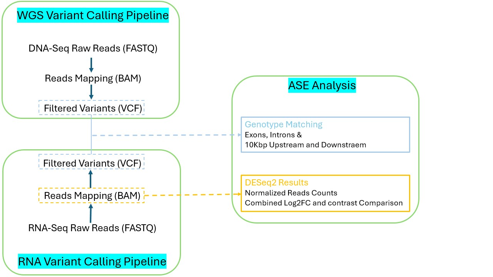

<h1>Running the pipeline</h1>

 The first step in the workflow running is to obtain variants from WGS and RNA-seq. Both pipelines for these steps can be found in the /BASH scripts. The resluts are VCF files.  
 Then after obtaining the read count matrix  R/ script can be applied to define the interesting cases where at least one of the family memebrs has log2FC > 1 and p-adj value < 0.05. 
 We achieved our read Count matrix using FeatureCount software, the matrix can be found in the table/ folder. 

 

 Output from the R script (the genes of interest) can be used as input for the next step in python scripts in order to identify the variants in the gene body completly or only in the Exons,  and in the surrounding regions (10kbp) up and downstream the gene of interest. 

<h2>Haplotype Phasing </h3>

<h3> This can be done using the phase_M.py script </h4>

 <strong>Phase_M.py</strong> takes inputs of a vcf file and the region of interest to be phased defined by the chromosme and both start and ending positions of the region 

<h3> Example </h3>

python3 phase_M.py -i vcf_for_the_family.vcf -chr Chr1 -s 1000 -e 10000

